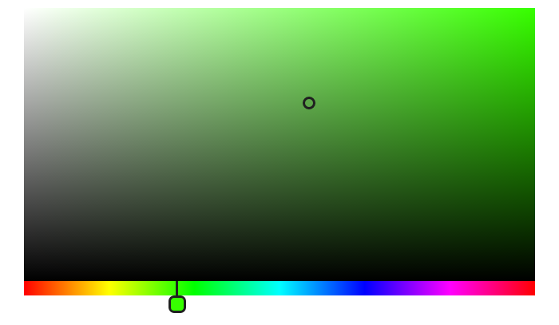

# Color picker
## Usage
```javascript
const ColorPicker = require ('simplecolorpicker')

let picker = new ColorPicker (element, {
  width: 640,
  height: 360,
  onchange: callback
})

```
## Result

